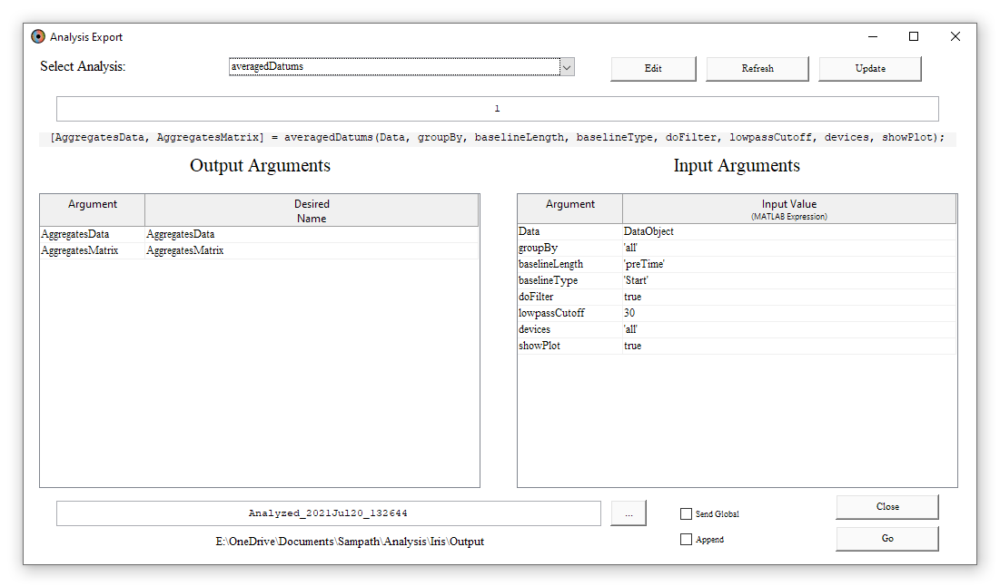

## Introduction
A key goal of Iris is to make collecting and working with recorded data simple,
straightforward and accessible. To achieve this, Iris provides a number of
avenues for the user to follow to achieve their analysis goals. Whether the user
would like to leverage Iris's capabilities and utilities to perform a complete
analysis, extract data as Iris's custom `IrisData` format to work with outside of
the Iris interface, to build custom modules for working with data directly in
the Iris interface, or to export data in the user's own format for use outside
of the Iris framework altogether, Iris provides a simple way to achieve the
user's goals.

## Using The Analyze Interface
Iris provides an interface to custom written analysis functions with the goal of
producing a simple in-out control of results all from within the application.
Once a data file is [loaded](BasicUsage.md), the user can then open the
*Analyze* interface from the Analysis menu.

<figure>

<figcaption><b>Figure 1.1</b> <em>The Analysis Window.</em></figcaption>
</figure>