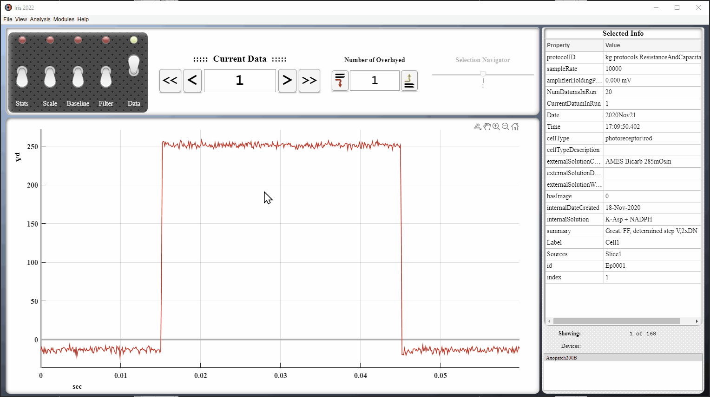

# Viewing Data

## Introduction

## Importing or Loading Data

Iris allows for mulitple files to be opened at once.

## [Navigation](navigation.md)

Iris offers a number of methods for navigating and displaying data. From traversing individual datums, to overlaying datums using a custom scheme.

## The Data Overview Interface

## Saving Data

While navigating a large data file, one may highlight a subset of data indices for export. Selected indices may be exported to disk as IrisData (`*.idata`) or delimited (`*.tsv,*.csv`) files or to the MATLAB global workspace by selecting the `Analysis > Export...` option. 

